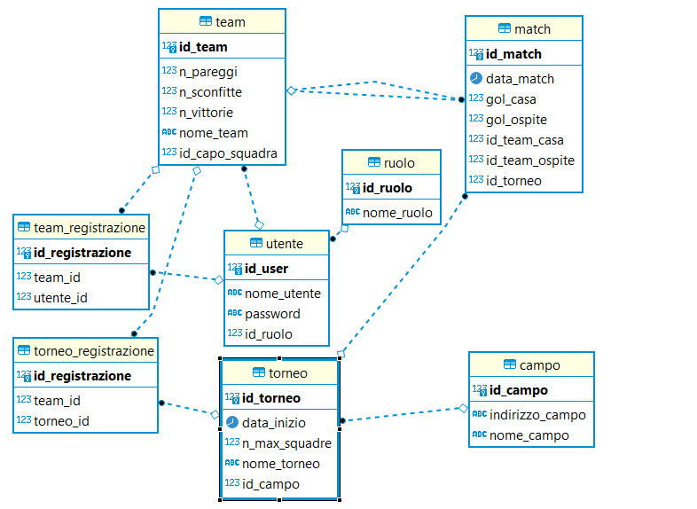

# Nome progetto
Gestionale Partite SpringBoot

## Descrizione del progetto
Il progetto simula un programma con il ruolo di gestire iscrizioni di Utenti e Squadre in un ipotetico circolo sportivo (es. calcetto).
L'accesso al progetto riservato ai soli soci, che hanno due ruoli ben distinti, quello di "UTENTE" e quello di "ADMIN".

### Feature
L'utente, una volta autenticato, ha possibilità di creazione del proprio Team, diventandone caposquadra, fare richiesta 
di accesso in altri e vedere la classifica generale di punteggio.

L'admin, una volta autenticato, ha possibilità di creare un torneo, gestire le registrazioni a tale torneo e generare il calendario e
accoppiamenti dei team per un match, ha la possibilità poi di, una volta terminato la partita, di settare il risultato cosicchè si aggiorni
Ha inoltre la possibilità di creare nuove utenti e nuovi admin.

## Tecnologie utilizzate
- Spring
- Maven 4
- Java 17

## Librerie utilizzate
- SpringBoot 2.7.4
- SpringSecurity
- JPA
- Lombok

## Dettagli Database
DB relazionale PostgreSQL utilizzato tramite immagine e relativo container Docker.
Di seguito il diagramma ER 

### Entità
- Utente
- Ruolo
- Team
- Match
- TeamRegistrazione
- TorneoRegistazione
- Torneo
- Campo

